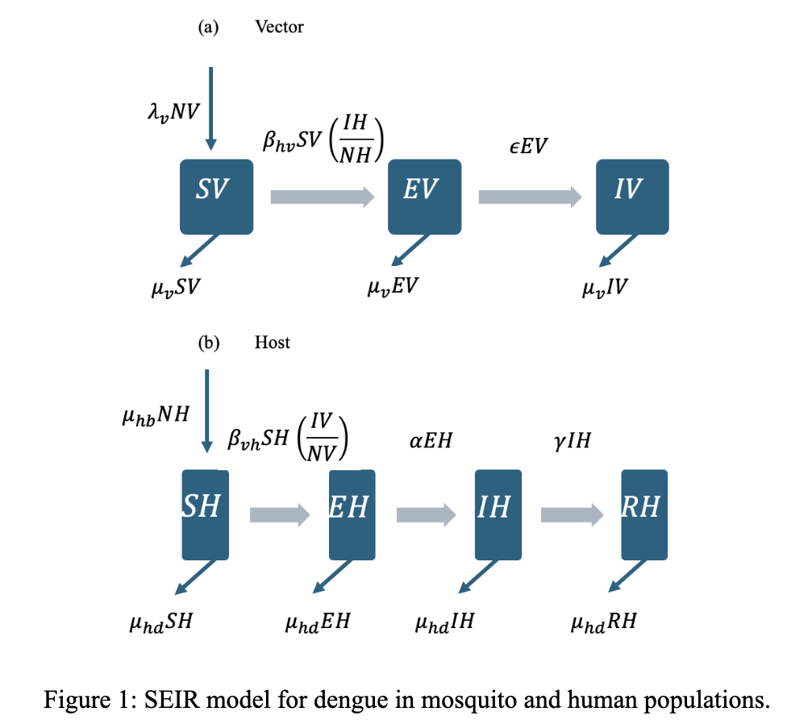
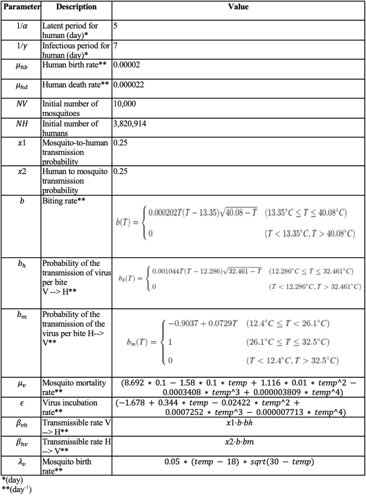

Assessing Aedes aegypti activity and dengue infection using CMIP5 temperature projections for Los Angeles, California: an exercise in temperature-dependent variability   
**Advisor: Wan Yang, PhD**    

### **Research Question**
What is the evidence-based effect of temperature-dependent parameters on a modeled initial outbreak of dengue fever under CMIP6 projections for Los Angeles, California?   

### **Methods**

#### Model Formulation
A single-strain, deterministic model was developed to study the transmission dynamics of a dengue outbreak in Los Angeles in 2025 given projected average annual temperatures.    

Parameters consisted of susceptible, exposed, and infectious female adult mosquitoes as well as susceptible, exposed, infectious, and recovered humans.    
The total population for both moquitoes and humans were denoted by NV and NH, respectively, and calculated by adding susceptible, exposed, infectious, and recovered populations.    

Model dynamics are described by a system of seven ordinary differential equations. The model did not account for the inflow of dengue through immigration or travel in order to focus on local transmission dynamics to understand the cases related to local mosquito-borne transmission.

#### Parameters Independent of Temperature

Parameters were obtained directly from peer-reviewed literature or scientifically-grounded assumptions.    
Temperature independent parameters include:  

*    latent and infectious periods for humans    
*    the human birth and death rate    
*    the human-to-mosquito and mosquito-to-human transmission probabilities

#### Parameters Dependent on Temperature

Temperature independent parameters include:   

*   the biting rate of the *Aedes* mosquito    
*   the per-bite probability of infection from human to mosquito   
*   the per-bite probability of infection from mosquito to human   
*   the mosquito mortality rate   
*   the mosquito birth rate   

The change in biting rate relative to temperature has previously been described using a Briere function, while other temperature-dependent parameters were estimated over a range of biologically-reasonable temperatures. These mechanistic equations were placed within the ODE function.   

Baseline temperatures were based on CMIP6 projections for Los Angeles in 2050, ranging from RCP 4.5 tp RCP 8.5.

Overall outbreak characteristics were determined by setting the initial number of infected humans and mosquitos to 10 and running the simulation while varying the starting temperature.

### **Results**

The function revealed that the peak number of infectious humans varied at unique predicted temperatures.     

The peak number of infectious humans was greatest at a starting temperature of 29 degrees Celsius, followed by a starting temperature of 27.5 degrees, 26 degrees, 24.5 degrees, and 23 degrees, with 21.5 degrees projected to have the lowest number of infected individuals at peak epidemic.

Maximum number of infectious humans is 206.43 humans at a temperature of 29 degrees Celsius. 

Although all six predicted temperatures show the epidemic end within 3 months, higher starting temperatures result in slightly longer epidemics. As temperature decreases, the length of the epidemic decreases. 

### **Discussion**
The study assesses the evidence-based effect of temperature-dependent parameters on a modeled initial outbreak of dengue fever under CMIP6 projections for Los Angeles, California. By incorporating temperature-dependent dengue virus dynamics of Aedes aegypti mosquitoes in an SEIR framework, our model reflects that within the time pperiod provided, climate change and rising temperature can influence conditions to endemic transmission, especially in urban areas such as Los Angeles affected by heat island effects.

The use of temperature-dependent parameters reflects biological relationships between climate change and dengue virus dynamics. This improves its ability to project realistic risk under various climate scenarios.

Future research should aim to integrate seasonality, simulate multiple dengue serotypes, and test intervention scenarios such as vaccination or vector-control.

### **Sources**
1. Dengue and severe dengue. Accessed May 6, 2025. https://www.who.int/news-room/fact-sheets/detail/dengue-and-severe-dengue
2.	X, Email, Bluesky. SoCal officials unleash sterile mosquitoes in bid to curb disease — with promising results. Los Angeles Times. May 6, 2025. Accessed May 6, 2025. https://www.latimes.com/environment/story/2025-05-06/sterile-male-mosquitoes-los-angeles-san-bernardino-dengue-aedes
3.	CDC. Current Dengue Outbreak. Dengue. April 22, 2025. Accessed May 6, 2025. https://www.cdc.gov/dengue/outbreaks/2024/index.html
4.	CDC. Potential Range of Aedes Mosquitoes. Mosquitoes. July 1, 2024. Accessed May 6, 2025. https://www.cdc.gov/mosquitoes/php/toolkit/potential-range-of-aedes.html
5.	Mapping Aedes aegypti (Diptera: Culicidae) and Aedes albopictus Vector Mosquito Distribution in Brownsville, TX | Journal of Medical Entomology | Oxford Academic. Accessed May 6, 2025. https://academic.oup.com/jme/article/57/1/231/5545953
6.	Liu Z, Zhang Q, Li L, et al. The effect of temperature on dengue virus transmission by Aedes mosquitoes. Front Cell Infect Microbiol. 2023;13:1242173. doi:10.3389/fcimb.2023.1242173
7.	Mordecai EA, Cohen JM, Evans MV, et al. Detecting the impact of temperature on transmission of Zika, dengue, and chikungunya using mechanistic models. PLoS Negl Trop Dis. 2017;11(4):e0005568. doi:10.1371/journal.pntd.0005568
8.	Trejo I, Barnard M, Spencer JA, et al. Changing temperature profiles and the risk of dengue outbreaks. PLOS Clim. 2023;2(2):e0000115. doi:10.1371/journal.pclm.0000115
9.	Damtew YT, Tong M, Varghese BM, et al. Effects of high temperatures and heatwaves on dengue fever: a systematic review and meta-analysis. eBioMedicine. 2023;91. doi:10.1016/j.ebiom.2023.104582
10. Lee H, Kim JE, Lee S, Lee CH (2018) Potential effects of climate change on dengue transmission dynamics in Korea. PLoS ONE 13(6): e0199205. https://doi.org/10.1371/journal.pone.0199205

11. Arévalo-Cortés, A., Granada, Y., Torres, D., & Triana-Chavez, O. (2022). Differential Hatching, Development, Oviposition, and Longevity Patterns among Colombian Aedes aegypti Populations. Insects, 13(6), 536. https://doi.org/10.3390/insects13060536

12. Mordecai EA, Cohen JM, Evans MV, Gudapati P, Johnson LR, et al. (2022) Correction: Detecting the impact of temperature on transmission of Zika, dengue, and chikungunya using mechanistic models. PLOS Neglected Tropical Diseases 16(6): e0010514. https://doi.org/10.1371/journal.pntd.0010514) 

13. High/low & average temperatures by month & Year downtown Los Angeles. Monthly High/Low and Average Temperatures by Year for Downtown Los Angeles, California. (n.d.). https://www.laalmanac.com/weather/we04a.php#google_vignette)

14. Adapt. Cal. (n.d.). https://cal-adapt.org/tools/annual-averages/

15. Bedsworth, Louise, Dan Cayan, Guido Franco, Leah Fisher, Sonya Ziaja. (California Governor’s Office of Planning and Research, Scripps Institution of Oceanography, California Energy Commission, California Public Utilities Commission). 2018. Statewide Summary Report. California’s Fourth Climate Change Assessment. Publication number: SUM-CCCA4-2018-013.)

16. Yang H, Macoris M, Galvani K, Andrighetti M, Wanderley D. Assessing the effects of temperature on the population of Aedes aegypti, the vector of dengue. Epidemiology and Infection. 2009;137(08):1188–1202. pmid:19192322
View ArticlePubMed/NCBIGoogle Scholar
