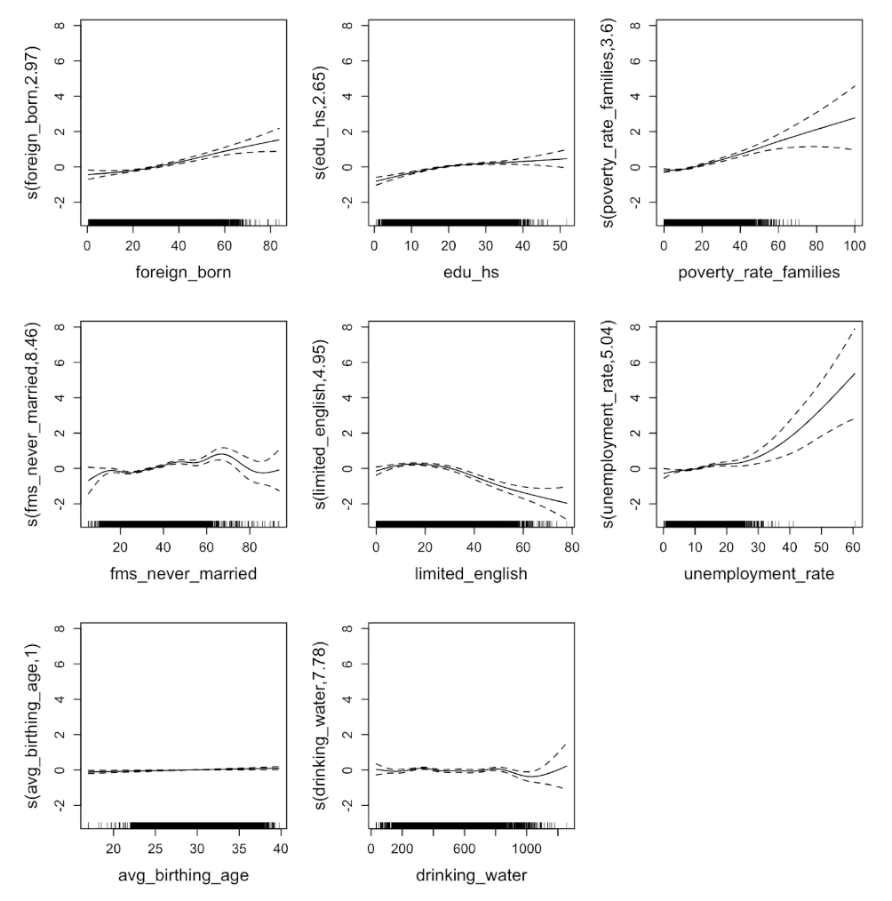

Drinking Water Contamination and Low Birth Weight in California: A Statistical Analysis    
**Advisor: Marianthi-Anna Kioumourtzoglou, ScD, MSPH**

### **Abstract**
**Objective:** To explore potential associations between low birth weight (LBW) and a drinking water contaminant (DWC) index in California.     
**Background:** Exposure to various drinking water contaminants has been associated with adverse pregnancy outcomes. Low birthweight disparities persist and are a major determinant of chronic illnesses later in life. California has a wealth of publicly available environmental and health data. The 2021 CalEnviroScreen 4.0 report includes data on LBW and DWC. We hypothesized that there were distributional effects, latent effect modifiers, and nonlinear relationships between DWC, LBW, and covariates.     
**Methods:** Quantile regression, non-linear exposure response curves, and factor analysis (FA) were applied at the census tract level.   
**Results:** Crude and adjusted statistical analyses found null associations between LBW and DWC. Poverty and unemployment rate exhibited nonlinear relationships. Risk factors with distributional effects were poverty, marital status, foreign birth, and unemployment. FA regression suggested that systemic disparities in minority communities may explain disparities in LBW in California.   
**Conclusions:** SES factors are stronger predictors of LBW in California than the DWC index. Further research is needed to elucidate the relationship between LBW and DWC. Public health interventions for LBW should prioritize SES.

### **Introduction**

### **Methods**
#### Study Population
#### Exposure Assessment
#### Outcome Assessment
#### Covariates
#### Statistical Methods
##### *Quantile and OLS Regression*
##### *Non-Linear exposure response* curves
##### *Factor Analysis (FA) Regression*

### **Results**
#### Population Charactertics
The average LBW across all census tracts was low, at 5.0%, with a relatively wide range from 0-13.7%. The DWC indicator also shows wide variability, with a mean of 479.6 and a range of about 33-1,258. The covariate summaries reflect variability in reproductive, socioeconomic, and demographic factors across all tracts.

#### Quantile and OLS Regression

#### Non-Linear Exposure Response Curves

 

#### Factor Analysis (FA)

### **Discussion**
#### Limitations and Strengths

### **Conclusion**

### **References**
1. August, L., Bangia, K., Plummer, L., Prasad, S., Ranjbar, K., Slocombe, A., & Wieland, W. (2021, October). CalEnviroScreen 4.0. State of California OEHHA.    
2. Coffman, V. R., Jensen, A. S., Trabjerg, B. B., Pedersen, C. B., Hansen, B., Sigsgaard, T., Olsen, J., Schaumburg, I., Schullehner, J., Pedersen, M., & Stayner, L. T. (2021). Prenatal Exposure to Nitrate from Drinking Water and Markers of Fetal Growth Restriction: A Population-Based Study of Nearly One Million Danish-Born Children. Environmental health perspectives, 129(2), 27002. https://doi.org/10.1289/EHP7331   
3. Diabelková, J., Rimárová, K., Urdzík, P., Dorko, E., Houžvičková, A., Andraščíková, Š., ... & Škrečková, G. (2022). Risk factors associated with low birth weight. Cent Eur J Public Health, 30(88), S43-9.    
4. DiSalvo, R. W., & Hill, E. L. (2024). Drinking Water Contaminant Concentrations and Birth Outcomes. Journal of policy analysis and management : [the journal of the Association for Public Policy Analysis and Management], 43(2), 368–399. https://doi.org/10.1002/pam.22558   
5. Environmental Protection Agency. (n.d.). EPA. https://www.epa.gov/sdwa/title-xiv-public-health-service-act-safety-public-water-systems-safe-drinking-water-act-0    
6. Frank J. Bove, Mark C. Fulcomer, Judith B. Klotz, Jorge Esmart, Ellen M. Dufficy, Jonathan E. Savrin, Public Drinking Water Contamination and Birth Outcomes, American Journal of Epidemiology, Volume 141, Issue 9, 1 May 1995, Pages 850–862, https://doi.org/10.1093/oxfordjournals.aje.a117521    
7. Grossman, D. S., & Slusky, D. J. G. (2019). The Impact of the Flint Water Crisis on Fertility. Demography, 56(6), 2005–2031. https://doi.org/10.1007/s13524-019-00831-0
8. Koenker, R. (2005). Quantile Regression. Cambridge: Cambridge University Press.   
9. Morton, R., & Henderson, B. L. (2008). Estimation of nonlinear trends in water quality: An improved approach using generalized additive models. Water Resources Research, 44(7). https://doi.org/10.1029/2007wr006191    
10. Oehha.ca.gov. (n.d.). https://oehha.ca.gov/calenviroscreen/report/calenviroscreen-40    
11. Posit team (2024). RStudio: Integrated Development Environment for R. Posit
  Software, PBC, Boston, MA. URL http://www.posit.co/.    
12. Venkatesh, K. K., Yee, L. M., Johnson, J., Wu, J., McNeil, B., Mercer, B., ... & Grobman, W. A. (2023). Neighborhood socioeconomic disadvantage and abnormal birth weight. Obstetrics & Gynecology, 142(5), 1199-1207.    
13. Zhang, M., Yang, B. Y., Sun, Y., Qian, Z., Xaverius, P. K., Aaron, H. E., ... & Yue, W. (2022). Non-linear relationship of maternal age with risk of spontaneous abortion: a case-control study in the china birth cohort. Frontiers in Public Health, 10, 933654.   
14. Zhuang, L. H., Chen, A., Braun, J. M., Lanphear, B. P., Hu, J. M. Y., Yolton, K., & McCandless, L. C. (2021). Effects of gestational exposures to chemical mixtures on birth weight using Bayesian factor analysis in the Health Outcome and Measures of Environment (HOME) Study. Environmental epidemiology (Philadelphia, Pa.), 5(3), e159. https://doi.org/10.1097/EE9.0000000000000159 
