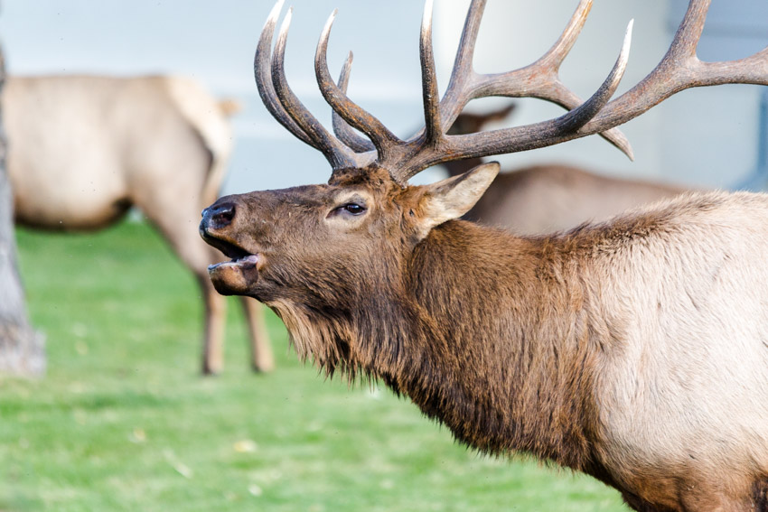
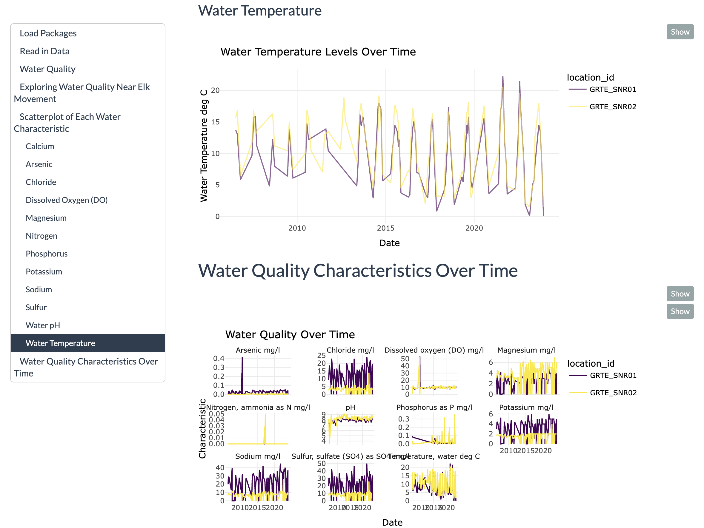
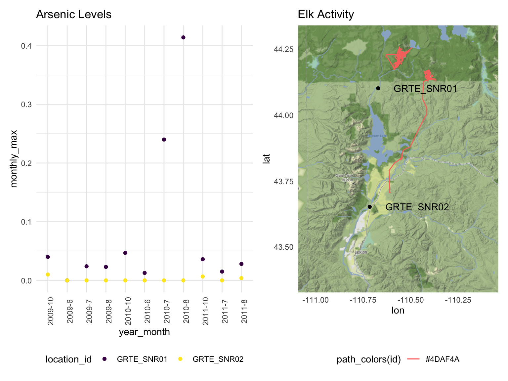
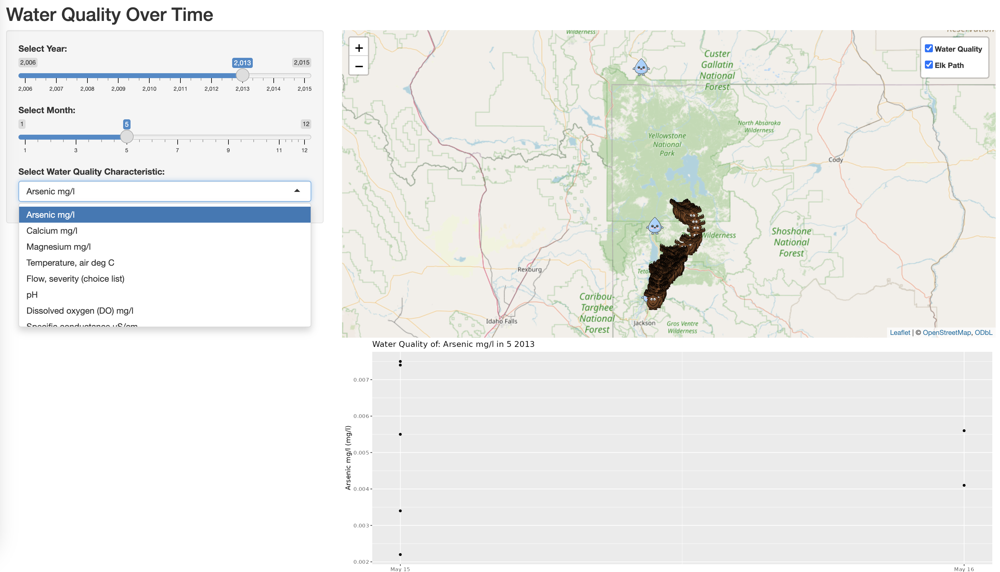

# The Elk, the Environment, and the Evolving Migration in Yellowstone    

*   Explored movement of 17 female elk through Yellowstone and the Grand Tetons National Park from 2006-2015   

*   Considered environmental factors such as weather, land cover, and water quality using R’s mapping capabilities to create an interactive visualization platform and assess differences in migration patterns    

### **Questions Considered**
1. Where do the elk move around in Yellowstone and the Grand Tetons National Parks?    
2. Do the elk that are collared with GPS signal move individually or as a pack?   
3. How does elk movement change over time of year and year to year?   
4. How do environmental factors such as weather, land cover, soil chemistry, and soil temperature affect the elk's migration patterns?   

### **Primary Analysis**
Water quality was collected at two sites that directly correlate to the path of elk movement, GRTE_SNR01 which refers to the Snake River water quality monitoring site at Flagg Ranch, Wyoming, and GRTE_SNR02 which refers to the Snake River water quality monitoring site at Moose, Wyoming.

### **Results**
We discovered that high arsenic concentrations were reported in July and August of 2010 at the GRTE_SNR01 site. At that time, elk were traveling along the site, potentially exposing themselves to unhealthy levels of arsenic in water.   
Other notable markers observed of poor water quality included dissolved oxygen and chloride, which may indicate the presence of lead in water that has no safe concentrations of exposure.

### **More Information**
For more information, check out the [website](https://brooklynnrm.github.io/Elk-Migration.github.io/report_graphics.html), [interactive dashboard](https://855lqb-tamara-pichardo.shinyapps.io/tp_elk/), and [screencast](https://youtu.be/GoROslWZ984).

