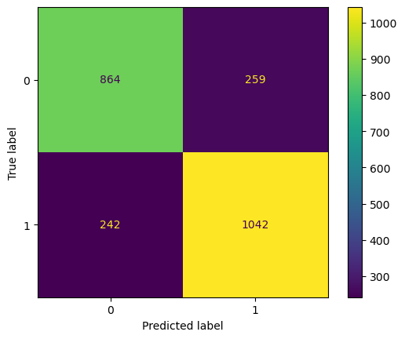
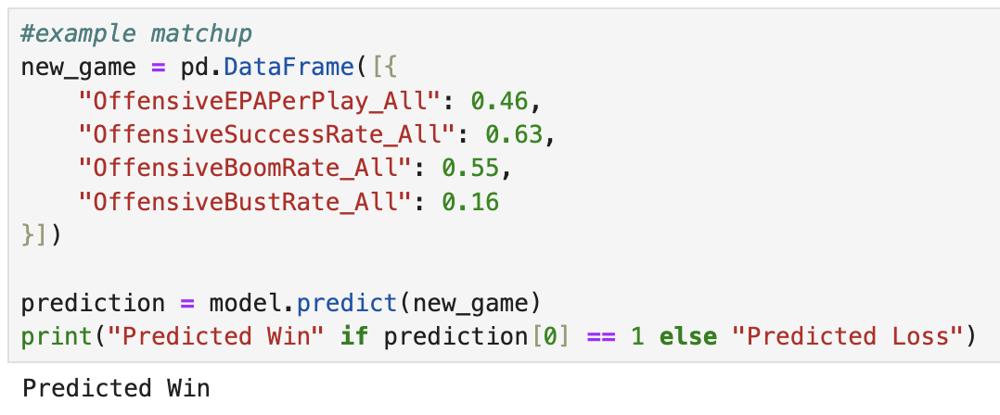

  
    
    

### **Machine Learning Model to Predict NCAA Football Game Outcomes**    
**Description**: Created a classification model to predict win/loss based on features such as overall offensive efficiency per play, percentage of plays with positive EPA, percentage of explosive, high-impact plays, and percentage of failed or negative plays. Evaluated using confusion matrix and acccuracy.   

**Key Skills**: Machine learning (random forest), model evaluation, scikit-learn    

**Link**: [GitHub](https://github.com/tpichardo7/footballml.git)

