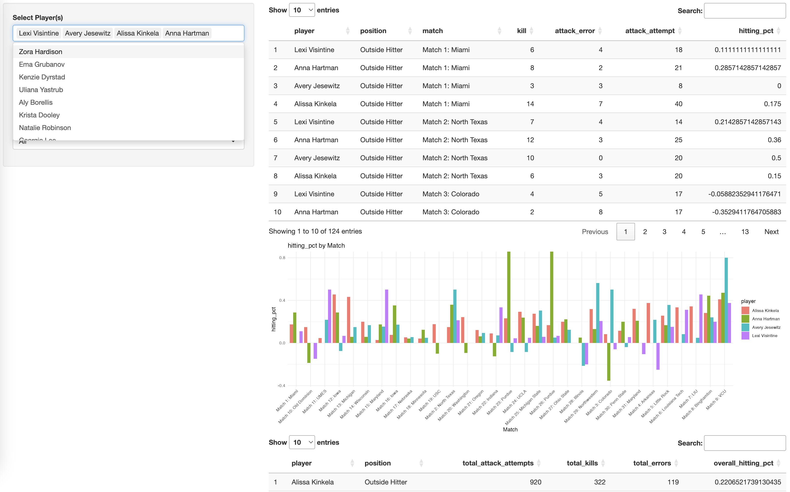

### **Interactive Volleyball Analytics Dashboard (inspired by Volleymetrics)**   
**Description**: An interactive dashboard designed to visualize volleyball player and team performance for the Rutgers Volleyball 2024 season, inspired by collegiate tools like Volleymetrics. The goal is to provide coaches, analysts, or fans with key insights using match-level data.  

**Tools & Technologies**: R/R Studio, Shiny Apps, Data cleaning, dashboard development (Tableau), volleyball-specific metrics  

**Project Structure**: 

*   Main Shiny App  
*   Raw and cleaned match data  
*   Dashboard images

**Problem Statement**: Can we provide a simplified, visual tool to help analyze volleyball match and player performance in real time?

**Methodology**: 

*   Cleaned and structured point-by-point data  
*   Aggregated key stats: kills, hitting percentage, digs, blocks, assists 
*   Created interactive filters by player, match, metric, and position

**Results**: 

*   Interactive dashboard with per-match and per-player performance tracking 
*   Visual charts for filtered player metrics

**Future Improvements**: 

*   Integrate match video: Link stats and visualizations to video clips for each play (similar to Volleymetrics)  
*   Implement data input system: Let teams upload their own CSV/stat sheet and generate dashboards automatically 
*   Use advanced volleyball metrics: Calculate metrics such as expected side-out percentage, serve efficiency based on serve receive efficiency, and rotation success rate 

**Link**: [GitHub](https://github.com/tpichardo7/volleydashboard.git)     

### **Scouting Report**  
**Description**: A scouting report used for St. Thomas Aquinas College. Report includes most likely starting lineup from analyzing 5 most recent matches of opponents. Specific player statistics, hitting tendencies and space available to write extra notes when reviewing with team. Includes defensive systems (blocking formation, floor defense system, players to watch and targets). Includes plays that will work against opponent defense, specifically for transition, serve receive, and free ball situations. Includes common plays opponent will run out of serve receive and serving targets. Allows players to mark common routes hitters will take and how they can set up blocking formation/defense.